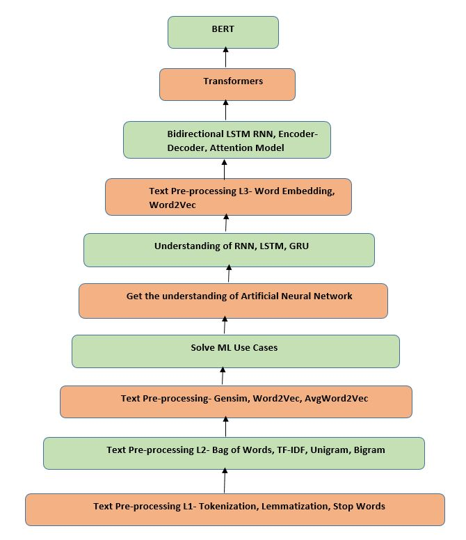

# Natural Language Processing (NLP) Roadmap

This repository contains a comprehensive roadmap for learning and mastering Natural Language Processing (NLP). Whether you're a beginner or looking to deepen your understanding of NLP, this roadmap provides a structured path to guide your studies and projects.

## Table of Contents
1. [Foundations of NLP](#foundations-of-nlp)
2. [Text Preprocessing](#text-preprocessing)
3. [Basic NLP Tasks](#basic-nlp-tasks)
4. [Machine Learning for NLP](#machine-learning-for-nlp)
5. [Advanced Text Representations](#advanced-text-representations)
6. [Deep Learning for NLP](#deep-learning-for-nlp)
7. [NLP Applications](#nlp-applications)
8. [Tools and Libraries](#tools-and-libraries)
9. [Practical Projects](#practical-projects)
10. [Keeping Up-to-date](#keeping-up-to-date)

## Foundations of NLP
- **Linguistics Basics**: Understanding syntax, semantics, morphology, and phonology.
- **Statistics and Probability**: Basic concepts essential for probabilistic models.
- **Mathematics for NLP**: Linear algebra, calculus, and optimization.

## Text Preprocessing
- **Tokenization**: Splitting text into words, subwords, or sentences.
- **Normalization**: Lowercasing, removing punctuation, and stemming/lemmatization.
- **Stop Words Removal**: Filtering out common but non-informative words.
- **Text Cleaning**: Handling misspellings, special characters, and noise.

## Basic NLP Tasks
- **Text Representation**: Bag of Words (BoW), Term Frequency-Inverse Document Frequency (TF-IDF).
- **Named Entity Recognition (NER)**: Identifying proper names in text.
- **Part-of-Speech Tagging (POS)**: Labeling parts of speech in sentences.
- **Chunking**: Grouping POS tags into phrases.

## Machine Learning for NLP
- **Supervised Learning**: Algorithms like Naive Bayes, SVM, and logistic regression.
- **Feature Engineering**: Creating meaningful features from text data.
- **Evaluation Metrics**: Precision, recall, F1-score, and confusion matrix.

## Advanced Text Representations
- **Word Embeddings**: Word2Vec, GloVe, and FastText.
- **Contextual Embeddings**: ELMo, BERT, GPT.

## Deep Learning for NLP
- **Neural Networks**: Basics of neural networks, backpropagation.
- **Recurrent Neural Networks (RNNs)**: LSTM and GRU.
- **Attention Mechanisms**: Understanding attention and self-attention.
- **Transformers**: BERT, GPT, and other transformer-based models.

## NLP Applications
- **Sentiment Analysis**: Analyzing sentiment in text.
- **Text Classification**: Classifying text into predefined categories.
- **Machine Translation**: Translating text from one language to another.
- **Summarization**: Generating concise summaries of documents.
- **Question Answering**: Building systems that answer questions posed in natural language.

## Tools and Libraries
- **Python Libraries**: NLTK, spaCy, Gensim, Scikit-learn.
- **Deep Learning Frameworks**: TensorFlow, PyTorch, Hugging Face Transformers.

## Practical Projects
- **Build an NER System**: Use spaCy or Hugging Face.
- **Create a Sentiment Analysis Model**: Using pre-trained models or custom datasets.
- **Develop a Chatbot**: Incorporate NLP techniques and frameworks.
- **Text Generation**: Using models like GPT-3.

## Keeping Up-to-date
- **Research Papers**: Regularly read papers from ACL, EMNLP, and NAACL.
- **Online Courses and Tutorials**: Coursera, edX, and YouTube channels.
- **Communities**: Join NLP communities on GitHub, Stack Overflow, and Reddit.

## Image
The roadmap image (`nlp.jpg`) provides a visual summary of the key areas covered in this roadmap. Ensure the image is placed in the same directory as this README file.

---

Feel free to explore the resources, follow the roadmap, and contribute to this repository by adding more resources or suggesting improvements!

